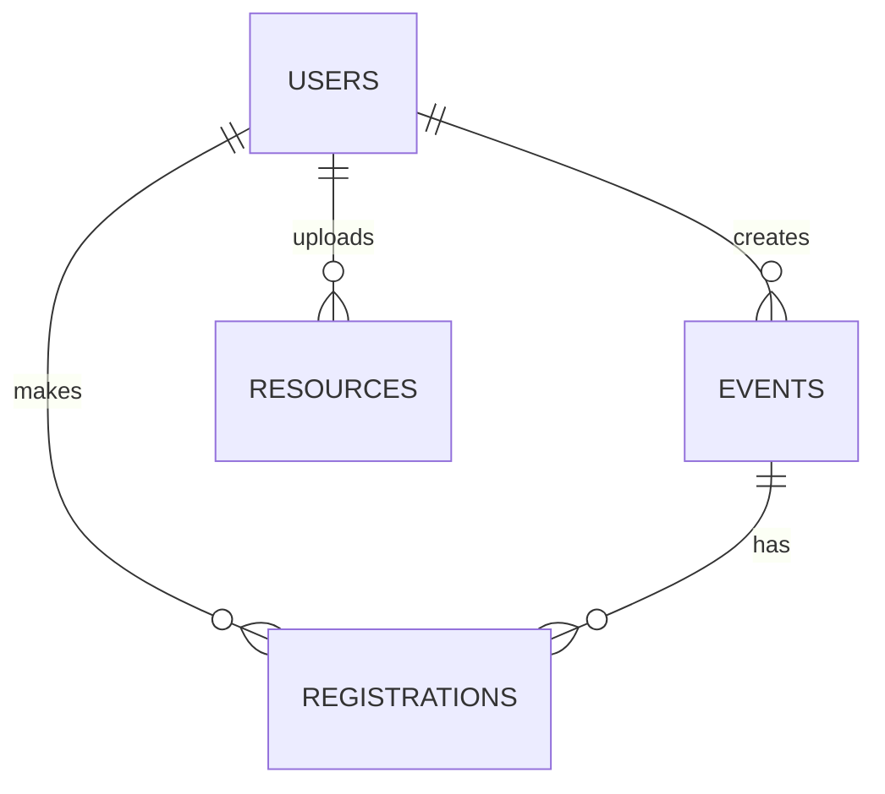

# CampusConnect — Student Event & Resource Portal
React (Vite) + Express 5 + PostgreSQL, JWT + bcrypt.

## Setup
1. Create a Postgres DB: `createdb campusconnect`
2. `cd server && cp .env.example .env` (edit DATABASE_URL, JWT_SECRET) then `npm install && npm run seed && npm run dev`
3. `cd client && npm install && npm run dev` -> http://localhost:5173
4. Admin login: admin@campus.com / Admin@123. Students sign up from the UI.
5. Tests: `cd server && npm test`

## ER diagram

## API (all except auth need `Authorization: Bearer <jwt>`)
POST /api/auth/signup, /login (rate-limited) | GET /api/events?search&category&date&page&limit | POST/PUT/DELETE /api/events[/:id] (admin) | POST/DELETE /api/events/:id/register (student) | GET /api/events/:id/registrations (admin) | GET /api/resources?subject&semester&page | POST /api/resources (admin, multipart) | GET /api/resources/:id/download | DELETE /api/resources/:id (admin) | GET /api/dashboard/student, /admin

Seat safety: registration runs in a transaction with `SELECT ... FOR UPDATE` on the event row.
Indexing bonus: seed many registrations, run `EXPLAIN ANALYZE` on the admin dashboard query with and without the indexes at the bottom of `db/schema.sql`.
